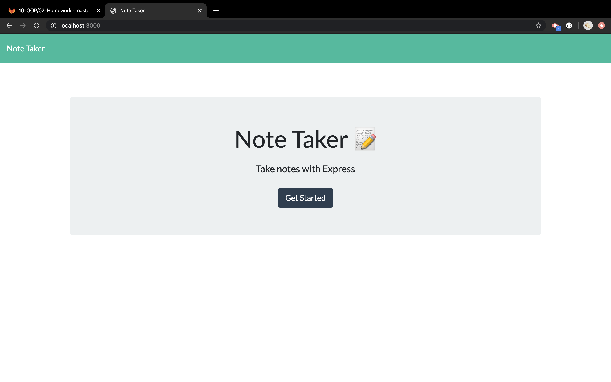
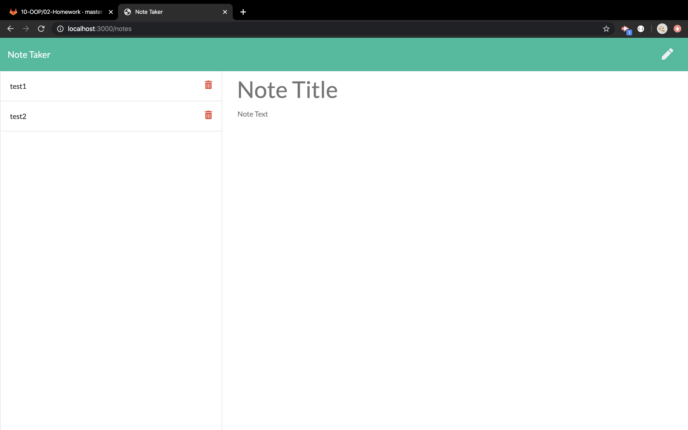

# Note-taker

* This application will use an express backend and save and retrieve note data from a JSON file.
* Run app.js in terminal to start a node server.
* Then visit localhost:3000 in the brower.

* click get start to run the app.

* notes that save/delete will sync to db.json file in db.
